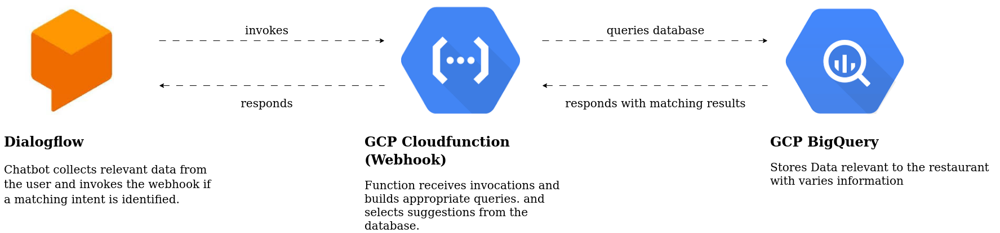

# 1. Chatbot development using Dialogflow ES and GCP (JUNE/JULY 2023)

In this Project I developed a chatbot using Dialogflow ES, GCP BigQuery, and a GCP Cloud Function(python). 
I put emphasis on the user and how they might want to get Restaurant recommendations. 
For this, a survey (from a different Project) was used. 
The restaurant data was more or less randomly generated based on the features, 
that were important to users, that took part in this survey. 

The dialogflow chatbot was not integrated with any system, it was tested with the test console, available at:  
https://dialogflow.cloud.google.com/ 

# 2. how the chatbot responds (intent = restaurant)

After getting a invocation from Dialogflow the webhook tries to build a valid sql query.

## step 1.

if a dish is given by the user 
the webhook queries the restaurant data to find a restaurant, that has that dish on the menu.
-> Dish can also be a list of dishes. However the webhook does not take multiple dishes into account. It returns the first (highest rated) restaurant, that has one of the dishes on the menu. 

if no restaurant with any of the given dishes exists, the webhook returns a response, saying:  
"I'm sorry, I could not find any Restaurant with the dishes [given dishes] on the Menu"  

## step 2.

if no dish is given 
the webhook builds a query taking all the given parameter into account  
- geo-city 
- price_range
- cuisine

if a parameter is not given it is ignored  
except for geo-city if it is not given the default_user_location is used  

## step 3. 

if step 2. did not find any restaurants a default query is build  
-> only taking geo-city and default_user_price_range into account  
if geo-city is not given the default_user_location is used  

## How does a response look like? 
# TODO

# 3. How does the architecture look like

 

# 4. How does the restaurant data look like and where is it saved 

The restaurant data was randomly generated based on the features, 
that were important to users, that took part in a survey. (This survey was not initially part of this Project)  
Except for the names.  

It is saved in a GCP BigQuery table named:  
`restaurantguide-9oyv.restaurant_guide.restaurants_random`

| name        | type    |                                                                              |
|-------------|---------|------------------------------------------------------------------------------|
| ----        | -----   |                                                                              |
| name        | str     | -> random restaurant names picked from data, that i scraped from yelp        |
| country     | str     | -> random cuisine, country based. for example "italian"                      |
| rating      | float64 | -> more or less random values between 0 and 5 however mostly between 3 and 4 |
| price_range | str     | -> random one of [low, medium, high]                                         |
| location    | str     | -> random one of ["Rome", "Florence", "Venice", "Turin", "Matera"]           |
| img_url     | str     | -> img url, that matches (more or less) the cuisine in column country        |
| menu_list   | list    | -> random list of dishes                                                     |

## Images 

The images used, were picked from the web to match some cuisine types that I wanted to use  
They are stored in a GCP Cloud Storage Bucket  

## menu_list -> why a list in a sql table?

The menu_list was an after though, it was not initially planned, but was later requested.  
However, I did not have enough time to setup and rewrite the code to use a NoSQL approach.  

## other datasets 

Resturants (used to get the names): https://www.kaggle.com/datasets/farukalam/yelp-restaurant-reviews  
Restaurants (not used): https://www.kaggle.com/datasets/uciml/restaurant-data-with-consumer-ratings?select=userprofile.csv  
Recepes (not used): https://eightportions.com/datasets/Recipes/#fn:1  

# 5. How does the user data look like 

<strong> In short, it does not exist! </strong>

A real chatbot, that works with user preferences, might also need some user specific preferences saved in a database.
However the goal of this project was not to build a implementation ready chatbot. It serves more like a concept. This is why I did not feel the need to generate the data. Instead I saved the preferences of a model user (me) to the src/config.ini file under "default_user_preferences". 
Please note, that I am not aware of any possibility to provide Dialogflow ES (without integration) with data, that is not given in a text request, like a user_id. which would be necessary to query a database. 
If the bot was integrated into a system, we could have the user login and get the user_id this why.  

